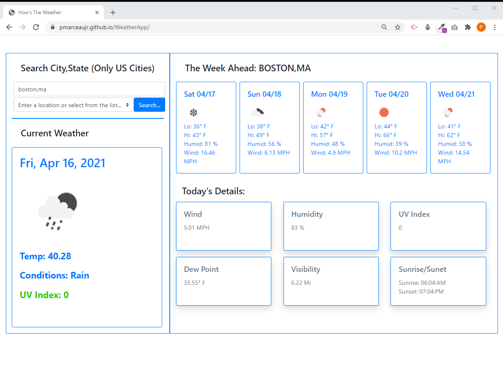

# WeatherApp

JavaScript, jQuery, day.js HTML, Bootstrap app to display daily and 5 day forecast weather for a specific city

GOAL: A simple JavScript program to dynamically display daily and 5 day forecast weather for a specific city

DESCRIPTION: Build a basic applicationto show how javscript can be used to dynamically manipulate HTML.  
Here we have a simple app to display daily and 5 day forecast weather for a specific city. When you first open the weather app it will default to a unpopulated display.Once the user enters in a US city and state the display will show th current wweather, the 5-day forecast and a couple other weather related items on the dashboard.

When the uer enters a valid city and state, the app will save the city,state to local storage for use in a history picklist.

LINK: https://pmarceaujr.github.io/WeatherApp/

SCREENSHOT:
